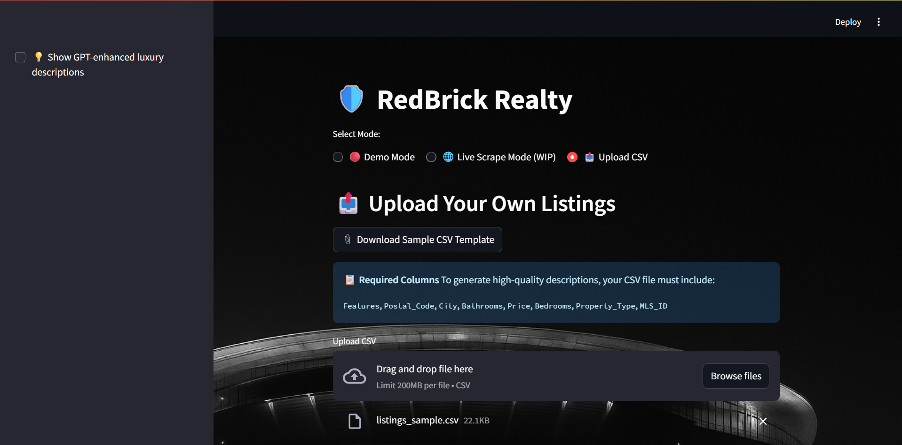
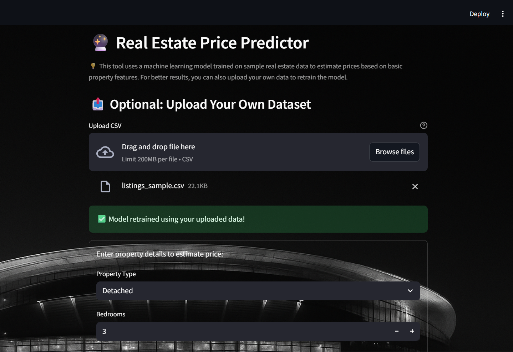

# 🛡️ RedBrick Realt

A Streamlit-powered app for generating high-quality, luxury-style real estate listing descriptions — inspired by the class and precision of Arsenal FC.

---

## 🔍 Features

- 🏠 Upload your own CSV listings or use demo mode
- ✨ Generate polished property descriptions with or without GPT-like enhancements
- 📄 Download all generated descriptions in a CSV
- 🧠 Bonus: Built-in price predictor trained on sample real estate data
- 🎨 Arsenal-themed branding and modern UI
- 🔐 Clean code with secure file handling and modular layout
- 🌐 Live Scrape Mode (Coming Soon) – UI ready, backend under development

---

## 📤 Required CSV Columns

To generate high-quality descriptions, your CSV must include:

`MLS_ID`, `Property_Type`, `Price`, `Bedrooms`, `Bathrooms`, `City`, `Postal_Code`, `Features`

📎 A downloadable `redbrick_template.csv` file is provided for guidance.
---

## 🧪 Demo Mode Preview

- Click "Demo Mode"
- Load a sample listing
- Generate description
- Optionally download as CSV

---


## 🧠 Real Estate Price Predictor

A bonus section at the bottom of the app lets you:
- Upload your own dataset to retrain the price model
- Use form inputs to predict property prices based on type, beds, baths, and city

---

## 🖼️ Screenshots

### 📤 Upload CSV & Sample Download


### 🔮 Real Estate Price Predictor



---

## 🚀 Run the App

### 1. Clone this repo
```bash
git clone https://github.com/arun-data-analyst/RedBrick-Realty.git
cd RedBrick-Realty
```

### 2. Install dependencies
```bash
pip install -r requirements.txt
```

### 3. Launch Streamlit
```bash
streamlit run app.py
```

---

## 📁 Folder Structure

```
RedBrick-Realty/
├── app.py
├── listings_sample.csv
├── requirements.txt
├── README.md
├── .gitignore
├── screenshots/
│   └── demo_ui.png
```

---

## 🛡️ Credits

Crafted by Arun Acharya · Inspired by Arsenal FC  
🔗 [GitHub Portfolio](https://github.com/arun-data-analyst)  
⚙️ Version: v1.4.3-patch2
